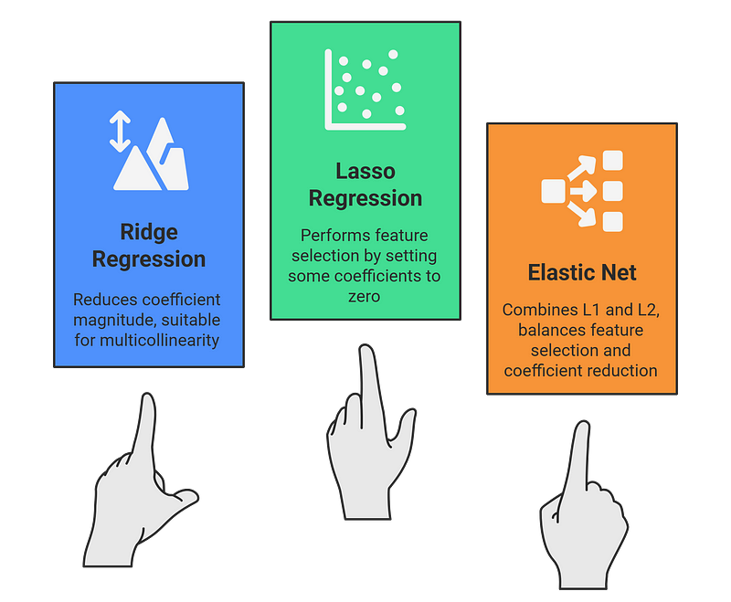
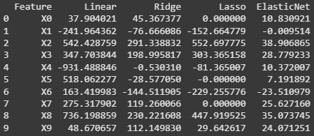
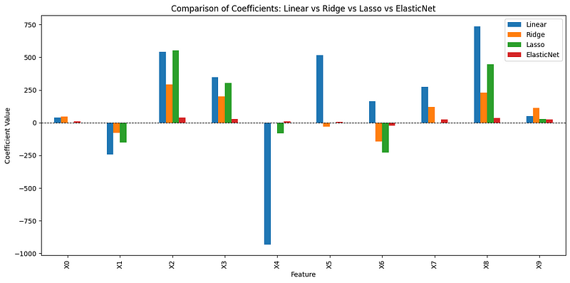

# Ridge vs. Lasso vs. Elastic Net: Which Regularization Technique Should You Use?

In the world of machine learning, overfitting is a common problem, especially when working with high-dimensional datasets. While traditional linear regression can struggle with noisy or correlated features, regularization techniques like Ridge, Lasso, and Elastic Net help impose discipline on the model, improving generalization.

But how do they work? When should you use one over the other? And what makes Elastic Net a useful middle ground?

In this article, we'll explore:
- How these regularization techniques work.
- Key differences and when to use each.
- A Python example comparing their behavior.

## The Problem: Overfitting in Linear Regression

Linear regression fits a line (or hyperplane) to predict outcomes based on input features. But it can lead to overfitting (i.e., the model performs well on training data but poorly on new, unseen data) when:
- The number of features is high.
- Some are correlated (multicollinearity).

To solve this, we introduce regularization.

## What is Regularization?

Regularization adds a penalty to the loss function of the model to discourage overly complex models. It reduces the magnitude of coefficients, thereby simplifying the model.

Three popular regularization techniques are:
- **Ridge Regression (L2 Regularization)**
- **Lasso Regression (L1 Regularization)**
- **Elastic Net (Combination of L1 and L2 Regularization)**



## Ridge Regression (L2)

Ridge adds the sum of the squares of the coefficients to the loss function:

.png)

Here, λ (lambda) is a hyperparameter that controls the strength of regularization. As λ increases, the model shrinks the coefficients more aggressively, but never sets them exactly to zero.

> **Note:** In the mathematical formula, the regularization strength is often denoted as λ (lambda), but in Python's scikit-learn, this parameter is referred to as α (alpha).

### Pros:
- Handles multicollinearity effectively.
- Retains all features, useful when all are relevant.
- Reduces overfitting by shrinking coefficients without removing predictors.

### Cons:
- Doesn't perform feature selection — irrelevant features stay.
- Less interpretable when identifying key predictors is important.

## Lasso Regression (L1)

Lasso adds the sum of the absolute values of the coefficients:

.png)

It encourages sparsity by shrinking some coefficients exactly to zero, making it great for feature selection.

### Pros:
- Performs automatic feature selection.
- Useful for high-dimensional data.
- Leads to simpler, more interpretable models.

### Cons:
- Struggles with correlated features, often selecting one arbitrarily.
- Risk of dropping useful features with small contributions.

## Elastic Net Regression (L1 + L2)

Elastic Net combines both L1 and L2 penalties, offering the advantages of both Ridge and Lasso:

.png)

It's especially useful when you have many features, some of which are correlated and potentially irrelevant.

### Why Use It?
- Combines L1's feature selection + L2's multicollinearity handling.

### Pros:
- Performs feature selection while handling multicollinearity.
- Ideal for high-dimensional, correlated datasets.
- Useful when it's unclear whether Ridge or Lasso alone is best.

### Cons:
- Requires tuning two hyperparameters (L1 and L2 weights).
- Slightly more complex to interpret and optimize.

## Python Example: Comparing Linear, Ridge, Lasso, and Elastic Net

### 1. Import Dependencies

```python
from sklearn.datasets import load_diabetes
from sklearn.linear_model import LinearRegression, Ridge, Lasso, ElasticNet
from sklearn.model_selection import train_test_split
import pandas as pd
import matplotlib.pyplot as plt
```

### 2. Load DataSet

```python
X, y = load_diabetes(return_X_y=True)
X_train, X_test, y_train, y_test = train_test_split(X, y, test_size=0.2, random_state=42)
```

### 3. Train Linear, Ridge, and Lasso

```python
# Initialize models
lr = LinearRegression()
ridge = Ridge(alpha=1.0)
lasso = Lasso(alpha=0.1)
elastic = ElasticNet(alpha=0.1, l1_ratio=0.5)  # l1_ratio=0.5 balances L1 and L2

# Fit models
lr.fit(X_train, y_train)
ridge.fit(X_train, y_train)
lasso.fit(X_train, y_train)
elastic.fit(X_train, y_train)

# Compare coefficients
coef_df = pd.DataFrame({
    'Feature': [f'X{i}' for i in range(X.shape[1])],
    'Linear': lr.coef_,
    'Ridge': ridge.coef_,
    'Lasso': lasso.coef_,
    'ElasticNet': elastic.coef_
})
print(coef_df)
```



### 4. Visualization

```python
coef_df.set_index('Feature').plot(kind='bar', figsize=(12, 6))
plt.title("Comparison of Coefficients: Linear vs Ridge vs Lasso vs ElasticNet")
plt.ylabel("Coefficient Value")
plt.axhline(0, color='black', linewidth=0.8, linestyle='--')
plt.tight_layout()
plt.show()
```


This bar chart compares the coefficients assigned by Linear, Ridge, Lasso, and ElasticNet regression models across 10 features (X0 to X9):

- Linear Regression (blue) assigns large positive or negative weights, especially for X4, and X8, indicating overfitting due to lack of regularization.
- Ridge (orange) reduces the magnitude of these extreme coefficients but retains all features, note how X4's impact is drastically lessened.
- Lasso (green) sets several coefficients (X5, and X7) exactly to zero, performing feature selection.
- ElasticNet (red) applies both L1 and L2 penalties, it shrinks all coefficients significantly and, like Lasso, zeroes out less important ones (e.g., X5, X7, X9), offering a balance between shrinkage and sparsity.

In a nutshell, regularization improves model generalization by controlling complexity. Ridge, Lasso, and ElasticNet each offer unique strengths, so choose based on your data's sparsity, dimensionality, and correlation. When in doubt, ElasticNet is often a reliable middle ground.
